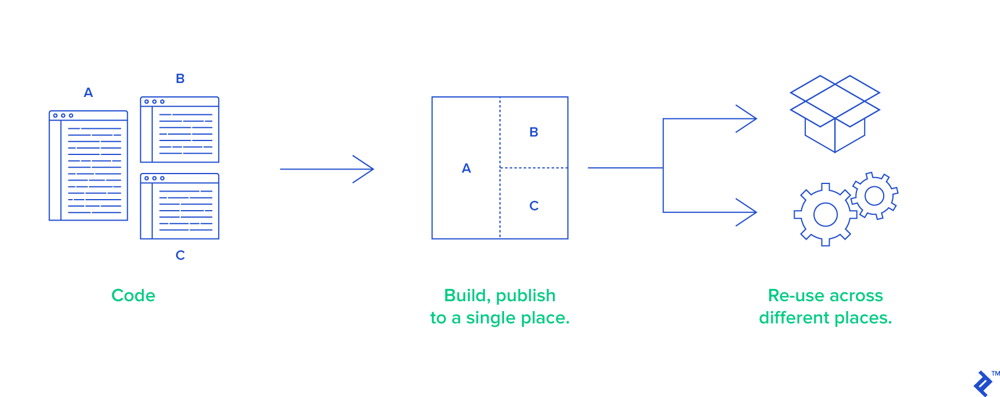
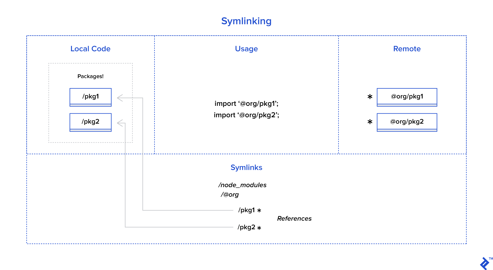

### monorepo

### lerna bootstrap

### reference

- [Full-stack monorepo](https://medium.com/burak-tasci/full-stack-monorepo)

- One place to store all configs and tests.
- Easily refactor global features with atomic commits.
- Simplified package publishing.
- Easier dependency management.
- Re-use code with shared packages while still keeping them isolated.
